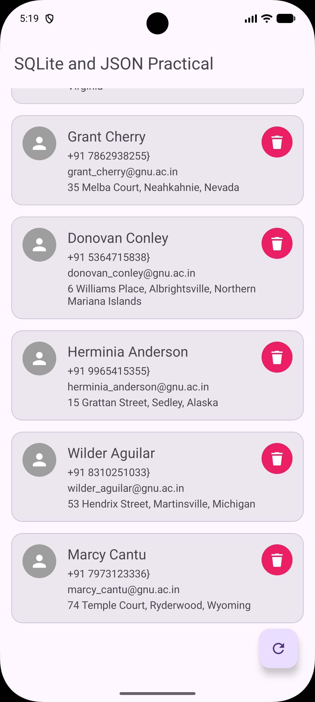

# 📱 Practical-7: SQLite & REST JSON API Integration

<p align="center">
  
  
  
  
  
</p>

---

> **Aim:** To develop an Android application that retrieves person data in JSON format from an internet API over HTTP connection and stores the retrieved data in an SQLite database for offline-first persistence.

---

## 📋 Table of Contents

- [🎯 Project Overview](#-project-overview)
- [⚡ Data Flow & Architecture](#-data-flow--architecture)
- [✨ Key Features](#-key-features)
- [⚠️ Important Technical Notes](#️-important-technical-notes)
- [📄 API Response Schema & Mapping](#-api-response-schema--mapping)
- [💾 Database Schema & Contract](#-database-schema--contract)
- [📁 Key Components & Code Architecture](#-key-components--code-architecture)
- [💡 Key Code Snippets](#-key-code-snippets)
- [📸 Screenshots](#-screenshots)
- [🛠 Tech Stack & Dependencies](#-tech-stack--dependencies)
- [🚀 How to Build & Run](#-how-to-build--run)
- [👤 Developer Info](#-developer-info)

---

## 🎯 Project Overview

This Android application demonstrates a complete end-to-end integration of **remote REST API communication**, **nested JSON parsing**, **asynchronous background processing**, and **local data persistence using SQLite** in Kotlin.

When the app is opened:
1. It queries the local SQLite database (`persons_db`).
2. If records exist, it populates the UI instantly (**Offline-First Access**).
3. If the database is empty, or when the user manually taps the refresh **Floating Action Button (FAB)**, the app initiates an HTTP GET request via `HttpURLConnection` with Bearer token authentication to fetch raw JSON contact profiles.
4. The nested JSON payload is parsed into `Person` model objects and saved to SQLite using an `INSERT OR REPLACE` conflict policy.
5. The dataset is dynamically rendered in a **RecyclerView** using Material card views, supporting real-time item deletion.

---

## ⚡ Data Flow & Architecture

```
                                  [ User Launches App / Hits Refresh FAB ]
                                                     │
                                                     ▼
                                        ┌─────────────────────────┐
                                        │  Check Local SQLite DB  │
                                        └────────────┬────────────┘
                                                     │
                         ┌───────────────────────────┴───────────────────────────┐
                         ▼                                                       ▼
                [ Contacts Found ]                                     [ Database Empty / Refreshed ]
                         │                                                       │
                         ▼                                                       ▼
            ┌─────────────────────────┐                             ┌─────────────────────────┐
            │  Render RecyclerView    │                             │  Launch Coroutine IO    │
            │  From Local SQLite DB   │                             └────────────┬────────────┘
            └─────────────────────────┘                                          │
                                                                                 ▼
                                                                    ┌─────────────────────────┐
                                                                    │ HttpURLConnection API   │
                                                                    │ (Bearer Auth Request)   │
                                                                    └────────────┬────────────┘
                                                                                 │
                                                                                 ▼
                                                                    ┌─────────────────────────┐
                                                                    │ Parse JSON Response     │
                                                                    │ (org.json.JSONObject)   │
                                                                    └────────────┬────────────┘
                                                                                 │
                                                                                 ▼
                                                                    ┌─────────────────────────┐
                                                                    │ Insert/Replace SQLite   │
                                                                    │ (persons_db)            │
                                                                    └────────────┬────────────┘
                                                                                 │
                                                                                 ▼
                                                                    ┌─────────────────────────┐
                                                                    │ Switch Dispatchers.Main │
                                                                    │ Update RecyclerView     │
                                                                    └─────────────────────────┘
```

---

## ✨ Key Features

- 🌐 **RESTful API Communications:** Communicates with remote JSON API endpoints using `HttpURLConnection`.
- 🔑 **Bearer Token Authorization:** Automatically passes `Authorization: Bearer <token>` and `Content-Type: application/json` headers in network calls.
- ⚡ **Asynchronous Concurrency:** Utilizes Kotlin `CoroutineScope` with `Dispatchers.IO` for non-blocking network I/O and DB operations, switching to `Dispatchers.Main` for UI thread updates.
- 📦 **Nested JSON Parsing:** Parses structured nested JSON (`profile.name`, `profile.address`, `profile.location.lat/long`) using native `org.json.JSONArray` and `org.json.JSONObject`.
- 💾 **SQLite Persistence:** Employs `SQLiteOpenHelper` to store contacts locally with a primary key `CONFLICT_REPLACE` policy.
- 📱 **Interactive Material UI:** Displays details in a `RecyclerView` with `MaterialCardView` cards, individual delete buttons, and a Floating Action Button (FAB).
- 🔄 **Offline First Access:** Data is read directly from the local database, ensuring zero network latency on app relaunch.

---

## ⚠️ Important Technical Notes

> [!IMPORTANT]
> 1. **INTERNET Permission:** Granted in `AndroidManifest.xml` via `<uses-permission android:name="android.permission.INTERNET" />`.
> 2. **API Authentication:** Network requests to `https://api.json-generator.com/templates/5rDXHcbgpo93/data` require a Bearer token (`d7wrtfqywyhu7y2bcbsz3cgjpbfisuhnmbibvgvf`) passed in request headers.
> 3. **Non-Blocking Execution:** Network and SQLite operations run exclusively on `Dispatchers.IO` to prevent UI lag or ANR (Application Not Responding) exceptions.
> 4. **SQLite Conflict Resolution:** Uses `SQLiteDatabase.CONFLICT_REPLACE` on primary key `id` to handle updates seamlessly without duplicate records.
> 5. **ViewBinding:** ViewBinding is enabled in `build.gradle.kts` for null-safe view references in `activity_main.xml` and `item_person.xml`.

---

## 📄 API Response Schema & Mapping

### Sample API Response (JSON)
```json
[
  {
    "id": "6732f9131e5f",
    "email": "john.doe@example.com",
    "phone": "+1 (800) 555-0199",
    "profile": {
      "name": "John Doe",
      "address": "123 Main St, New York, NY 10001",
      "location": {
        "lat": 40.7128,
        "long": -74.0060
      }
    }
  }
]
```

### JSON to Model Mapping (`Person.kt`)
| JSON Path | Model Property | Data Type |
| :--- | :--- | :--- |
| `id` | `id` | `String` (Primary Key) |
| `profile.name` | `name` | `String` |
| `email` | `emailId` | `String` |
| `phone` | `phoneNo` | `String` |
| `profile.address` | `address` | `String` |
| `profile.location.lat` | `latitude` | `Double` |
| `profile.location.long` | `longitude` | `Double` |

---

## 💾 Database Schema & Contract

**Database Name:** `persons_db`  
**Database Version:** `1`  
**Table Name:** `persons`  

```sql
CREATE TABLE persons(
    id TEXT PRIMARY KEY,
    person_name TEXT,
    person_email_id TEXT,
    person_phone_no TEXT,
    person_address TEXT,
    person_lat REAL,
    person_long REAL
);
```

---

## 📁 Key Components & Code Architecture

| Component | Class / File | Description |
| :--- | :--- | :--- |
| **Main Activity** | `MainActivity.kt` | Coordinates lifecycle, Coroutines, API fetch triggers, JSON parsing, and adapter notifications. |
| **Network Client** | `HttpRequest.kt` | Executes `HttpURLConnection` with request headers and converts input stream to String. |
| **Database Helper** | `DatabaseHelper.kt` | Extends `SQLiteOpenHelper`. Provides CRUD methods (`insertPerson`, `getPerson`, `allPersons`, `deletePerson`, `updatePerson`). |
| **Table Contract** | `PersonDbTableData.kt` | Defines SQLite table schema constants and `CREATE TABLE` query syntax. |
| **Data Model** | `Person.kt` | Data class implementing `Serializable` holding contact profile fields. |
| **List Adapter** | `PersonAdapter.kt` | `RecyclerView.Adapter` binding contact profiles to card items and listening for delete actions. |

---

## 💡 Key Code Snippets

### 1. HTTP Request with Bearer Header (`HttpRequest.kt`)
```kotlin
val url = URL(reqUrl)
val conn = url.openConnection() as HttpURLConnection
if (token != null) {
    conn.setRequestProperty("Authorization", "Bearer $token")
    conn.setRequestProperty("Content-Type", "application/json")
}
conn.requestMethod = "GET"
response = convertStreamToString(BufferedInputStream(conn.inputStream))
```

### 2. SQLite Conflict Replacement (`DatabaseHelper.kt`)
```kotlin
fun insertPerson(person: Person): Long {
    val db = writableDatabase
    val id = db.insertWithOnConflict(
        PersonDbTableData.TABLE_NAME,
        null,
        getValues(person),
        SQLiteDatabase.CONFLICT_REPLACE
    )
    db.close()
    return id
}
```

### 3. Asynchronous Fetch & Coroutine UI Switch (`MainActivity.kt`)
```kotlin
CoroutineScope(Dispatchers.IO).launch {
    val json = HttpRequest().makeServiceCall(API_URL, API_TOKEN)
    withContext(Dispatchers.Main) {
        if (json != null) {
            val fetched = parsePersonsFromJson(json)
            fetched.forEach { dbHelper.insertPerson(it) }
            persons.clear()
            persons.addAll(dbHelper.allPersons)
            adapter.notifyDataSetChanged()
        }
    }
}
```

---

## 📸 Screenshots

<p align="center">
  
</p>

---

## 🛠 Tech Stack & Dependencies

- **Language:** Kotlin 1.9+
- **Database:** SQLite (`SQLiteOpenHelper`)
- **Concurrency:** Kotlin Coroutines (`kotlinx-coroutines-android`)
- **UI Components:** `RecyclerView`, `MaterialCardView`, `FloatingActionButton`, `ProgressBar`
- **Architecture:** ViewBinding (`build.gradle.kts`)
- **Min SDK:** 24 (Android 7.0)
- **Target SDK:** 34 / 35 (Android 14 / 15)

---

## 🚀 How to Build & Run

1. **Clone the Repository:**
   ```bash
   git clone https://github.com/maharsh-patel/MAD_24012011102_Practical_7.git
   ```
2. **Open in Android Studio:**
   - Launch Android Studio (Hedgehog or newer).
   - Select **Open** and select the cloned project directory.
3. **Gradle Sync:**
   - Allow Gradle to sync dependencies and build configuration.
4. **Run Application:**
   - Connect an Android device or launch an Emulator (API 24+).
   - Press **Run** (`Shift + F10`).

---

## 👤 Developer Info

<p align="center">
  <b>Maharsh Patel</b><br>
  🆔 Enrollment No: <b>24012011102</b><br>
  🎓 Mobile Application Development (MAD) • Practical 7<br>
  🏫 UVPCE
</p>

---
